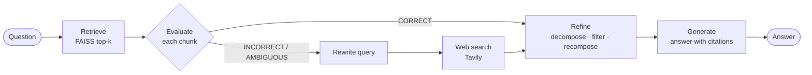

# Corrective RAG (CRAG) with LangGraph

A retrieval-augmented question-answering pipeline that **checks its own retrieval
before trusting it**. Built with LangGraph, OpenAI, FAISS and Tavily, following the
paper [*Corrective Retrieval Augmented Generation*](https://arxiv.org/abs/2401.15884)
(Yan et al., 2024).


---

## Why this exists

Standard RAG passes whatever the retriever returns straight to the LLM. When the
retrieved chunks are off-topic, the model answers from them anyway, and you get a
confident, well-formatted, wrong answer.

**CRAG adds a quality gate.** Every retrieved chunk is scored, and the pipeline takes
one of three actions:

| Verdict | Trigger | Knowledge used for the answer |
|---|---|---|
| **CORRECT** | any chunk scores > 0.7 | your documents only |
| **INCORRECT** | all chunks score < 0.3 | web search only |
| **AMBIGUOUS** | anything else | your documents **+** web search |

Whatever knowledge is chosen is then **refined**: split into sentence-level strips,
filtered for relevance, and recomposed, so the generator sees a short, focused,
source-tagged context.

## How it works



📖 **New to CRAG?** Start with the docs:

1. [The Concept](docs/01-crag-concept.md): what problem CRAG solves and how, in plain language
2. [Code Walkthrough](docs/02-code-walkthrough.md): one question traced through every file
3. [Paper vs Implementation](docs/03-paper-vs-implementation.md): where this build differs from the paper, and its known weaknesses

## Quickstart

```bash
git clone https://github.com/YOUR_USERNAME/corrective-rag.git
cd corrective-rag

python -m venv .venv && source .venv/bin/activate   # Windows: .venv\Scripts\activate
pip install -e .

cp .env.example .env        # then add OPENAI_API_KEY and TAVILY_API_KEY
```

Put the PDFs you want to query in [`data/`](data/README.md), then ask a question:

```bash
python -m crag "Batch normalization vs layer normalization" --trace
```

The first run embeds your PDFs and saves a FAISS index to `.index/`; later runs reload it.

### Example output

From the notebook run over three PDFs:

```text
VERDICT: AMBIGUOUS
REASON: No chunk scored > 0.7, but not all were < 0.3.
WEB_QUERY: Batch normalization vs layer normalization

OUTPUT:
 Batch normalization (BN) normalizes over the examples in a mini-batch, making it
 effective for feedforward neural networks and convolutional neural networks (CNNs).
 [...]
 Layer normalization (LN), on the other hand, normalizes across the features for each
 individual example, making it more suitable for recurrent neural networks (RNNs) [...]
```

The books had partial coverage (no chunk was a confident match), so CRAG combined
internal strips with web results. The CLI's `--trace` additionally prints per-chunk
scores, the number of strips kept, and a numbered source list for citations.

### Use it from Python

```python
from dotenv import load_dotenv
from crag.config import Settings
from crag.graph import build_default_components, build_graph

load_dotenv()
settings = Settings.from_env()
app = build_graph(build_default_components(settings), settings)

result = app.invoke({"question": "What is dropout?"})
print(result["verdict"], result["answer"], result["sources"], sep="\n")
```

### Or explore the notebook

[`notebooks/corrective_rag.ipynb`](notebooks/corrective_rag.ipynb) is the original,
single-file version with the rendered graph and an example run.

## Configuration

All settings have defaults and can be overridden in `.env`:

| Variable | Default | Purpose |
|---|---|---|
| `CRAG_LLM_MODEL` | `gpt-4o-mini` | evaluator, filter, rewriter and generator |
| `CRAG_EMBEDDING_MODEL` | `text-embedding-3-large` | chunk embeddings |
| `CRAG_TOP_K` | `4` | chunks retrieved per question |
| `CRAG_UPPER_THRESHOLD` | `0.7` | above this, a chunk makes the verdict CORRECT |
| `CRAG_LOWER_THRESHOLD` | `0.3` | if every chunk is below this, INCORRECT |
| `CRAG_SENTENCES_PER_STRIP` | `1` | strip size for refinement (paper uses a few) |
| `CRAG_WEB_MAX_RESULTS` | `5` | Tavily results per search |
| `CRAG_MAX_CONCURRENCY` | `8` | parallel LLM calls when scoring |

See [`.env.example`](.env.example) for the full list.

## Project structure

```
corrective-rag/
├── src/crag/            # the pipeline as a package
│   ├── logic.py         #   pure decision logic (verdicts, strip decomposition)
│   ├── nodes.py         #   LangGraph nodes
│   ├── graph.py         #   graph wiring + real OpenAI / Tavily components
│   ├── indexing.py      #   PDF → chunks → FAISS (persisted)
│   ├── prompts.py       #   all prompts and output schemas
│   ├── state.py, config.py, cli.py
├── tests/               # unit + end-to-end graph tests with fakes (no API keys)
├── notebooks/           # original exploratory notebook
├── docs/                # concept, walkthrough, paper comparison
├── data/                # your PDFs (git-ignored)
└── .github/workflows/   # CI: ruff + pytest on 3.10–3.12
```

## Testing

```bash
pip install -e ".[dev]"
pytest          # 27 tests, < 1 s, no network
ruff check .
```

The graph tests swap every LLM, retriever and search call for a deterministic fake,
then verify each of the three routes end to end: CORRECT never calls the web,
INCORRECT discards internal docs, AMBIGUOUS merges both in order with correct
source tags.

## Limitations and roadmap

This is a learning implementation, not a benchmark reproduction. The main gaps
(detailed in [docs/03](docs/03-paper-vs-implementation.md)):

- [ ] **Evaluation.** Build a small labeled question set and compare against plain RAG.
- [ ] **Evaluator.** Replace the prompted LLM judge with a cross-encoder reranker and
      calibrate thresholds on labeled data.
- [ ] **Comparison questions.** The evaluator's "chunk alone is sufficient" criterion
      penalizes multi-part questions.
- [ ] **Cost.** Batch strip filtering into one call per document.
- [ ] **Sentence splitting.** Swap the regex for `pysbd`.

## Reference

```bibtex
@article{yan2024corrective,
  title   = {Corrective Retrieval Augmented Generation},
  author  = {Yan, Shi-Qi and Gu, Jia-Chen and Zhu, Yun and Ling, Zhen-Hua},
  journal = {arXiv preprint arXiv:2401.15884},
  year    = {2024}
}
```

Official implementation by the authors: [HuskyInSalt/CRAG](https://github.com/HuskyInSalt/CRAG).

## License

[MIT](LICENSE)
