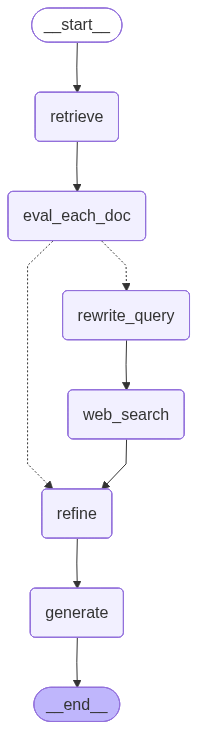

# 1. The Concept: Corrective RAG (CRAG)

> Based on *Corrective Retrieval Augmented Generation*, Yan, Gu, Zhu & Ling, 2024
> ([arXiv:2401.15884](https://arxiv.org/abs/2401.15884)).

## The problem with plain RAG

Retrieval-Augmented Generation (RAG) works like this:

```
question ──► retriever ──► top-k chunks ──► LLM ──► answer
```

The LLM is told "answer using these chunks". That's the whole trick, and it is also
the weak point: **the LLM trusts whatever the retriever hands it.** If retrieval
returns chunks that are only superficially similar to the question (same keywords,
wrong topic), the model tends to either:

- hallucinate an answer stitched together from irrelevant text, or
- confidently give a wrong answer that *looks* grounded.

The paper's opening example: asked who wrote the screenplay for *Death of a Batman*,
a retriever returns a passage about the 1989 *Batman* film that happens to mention a
screenwriter named Hamm. The generator answers "Hamm", which is wrong.

Vanilla RAG never asks *"Are these documents actually any good?"* CRAG adds that step.

## The CRAG idea in one sentence

**Grade the retrieved documents before using them, and take a different action
depending on how good they are.**

## The three components

### 1. Retrieval evaluator

A model scores every retrieved document for relevance to the question. In the paper
this is a fine-tuned T5-large (about 0.77B parameters) that outputs a score in
[-1, 1]. In this project it is an LLM prompted to return a score in [0, 1].

### 2. Action trigger (the heart of CRAG)

Two thresholds split the scores into three verdicts:

| Verdict | Condition | What CRAG does |
|---|---|---|
| **CORRECT** | at least one doc scores **above the upper** threshold | Trust internal knowledge. Refine the retrieved docs and answer from them. |
| **INCORRECT** | **all** docs score **below the lower** threshold | Throw the retrieved docs away. Search the web instead. |
| **AMBIGUOUS** | anything in between | Hedge: use refined internal docs **plus** web results. |

```
             score
   0 ─────────┬──────────────────────┬───────── 1
    INCORRECT │       AMBIGUOUS      │ CORRECT
           lower                   upper
```

Why three actions and not two? The authors report that with only CORRECT/INCORRECT,
the system became very sensitive to evaluator mistakes: a single misjudgment flipped
the entire knowledge source. AMBIGUOUS is a soft middle ground that reduces that
dependence on a perfect evaluator.

### 3. Knowledge refinement: decompose, filter, recompose

Even a relevant document is mostly noise relative to one specific question. CRAG
refines it:

1. **Decompose** each document into small *knowledge strips* (a few sentences each).
2. **Filter**: score each strip and drop irrelevant ones.
3. **Recompose**: concatenate the surviving strips in order.

The generator then sees a short, dense context instead of full chunks.

### 4. Web search as a fallback

When internal retrieval fails, CRAG:

1. **Rewrites** the question into a keyword-style search query (search engines
   respond better to keywords than to conversational questions).
2. **Searches** the web (the paper used Google Search, preferring Wikipedia pages).
3. **Refines** the web results with the same decompose-filter-recompose step.

## Full flow



```
                      ┌──────────────┐
question ──► retrieve ──► evaluate ─┤
                      └──────────────┘
                 CORRECT │      │ INCORRECT / AMBIGUOUS
                         │      ▼
                         │   rewrite query ──► web search
                         ▼                        │
                      refine  ◄───────────────────┘
       (CORRECT: internal | INCORRECT: web | AMBIGUOUS: both)
                         │
                         ▼
                      generate ──► answer
```

## What the paper found

Headline results, all on 7B LLaMA-2 generators:

- **CRAG improved standard RAG on all four benchmarks.** For example, on PopQA with
  the SelfRAG-LLaMA2-7b generator, accuracy went from 52.8 to 59.8.
- **Every piece mattered.** Removing any single action, or removing refinement,
  query rewriting, or web-result selection, lowered accuracy in their ablations.
  Removing refinement hurt the most.
- **The gains are not just "extra web data".** Giving plain RAG the same web results
  without the correction logic helped much less (Table 5 in the paper).
- **The evaluator matters a lot, and prompting ChatGPT as the evaluator was
  noticeably worse than their fine-tuned T5.** On PopQA, the T5 evaluator judged
  retrieval quality with 84.3% accuracy, versus 58.0 to 64.7% for ChatGPT variants.
  This is directly relevant to this project, which uses an LLM-as-judge evaluator
  (see [Paper vs Implementation](03-paper-vs-implementation.md)).
- **Overhead was modest** in their setup because the evaluator is small.

## Limitations the authors acknowledge

- CRAG requires a separately fine-tuned retrieval evaluator.
- Web search can introduce unreliable content; they mitigate it by preferring
  authoritative sources such as Wikipedia.
- Thresholds were tuned per dataset, so they don't transfer automatically.

## Glossary

| Term | Meaning |
|---|---|
| **RAG** | Retrieval-Augmented Generation: retrieve text, then generate an answer from it. |
| **Chunk** | A slice of a source document stored in the vector index. |
| **Retrieval evaluator** | Model that grades each retrieved chunk's relevance. |
| **Verdict / action** | CORRECT, INCORRECT or AMBIGUOUS; decides where knowledge comes from. |
| **Knowledge strip** | A small piece (one or a few sentences) of a document. |
| **Internal knowledge** | Refined strips from your own document corpus. |
| **External knowledge** | Refined strips from web search results. |
